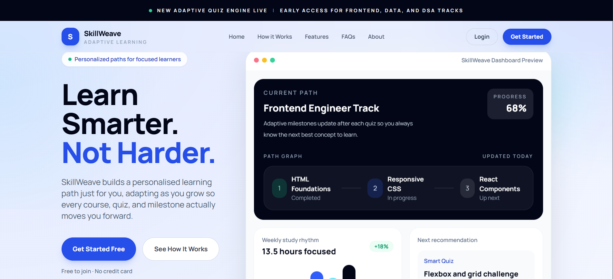
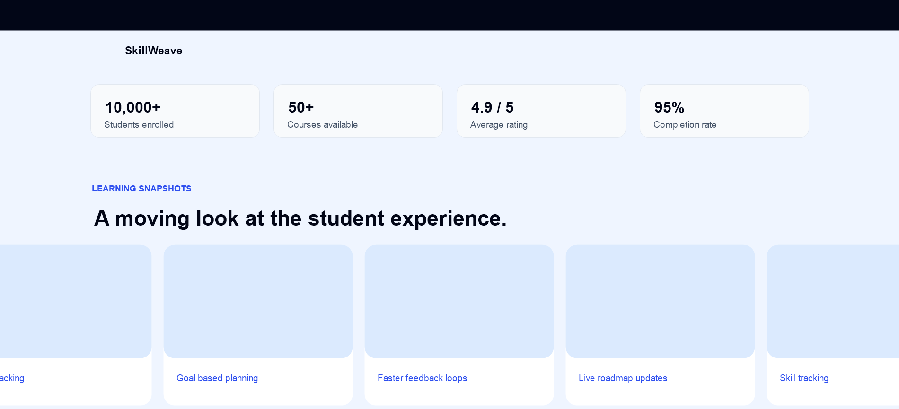
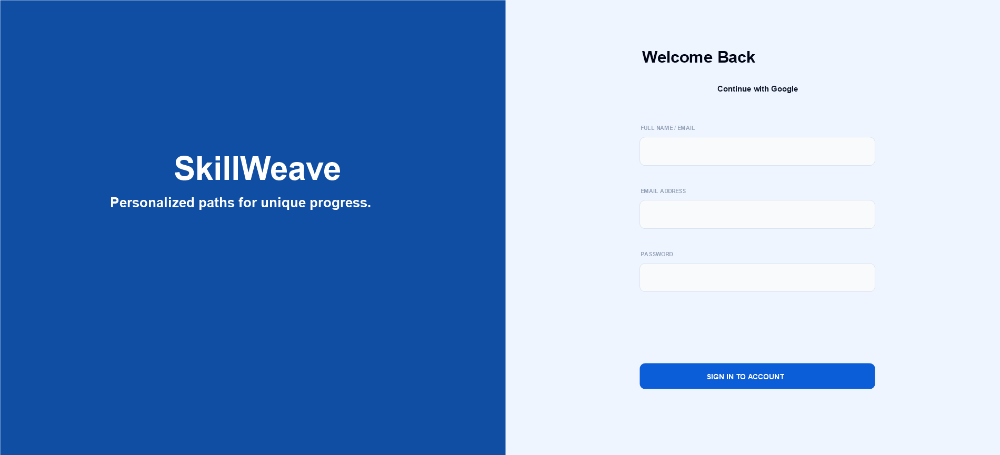
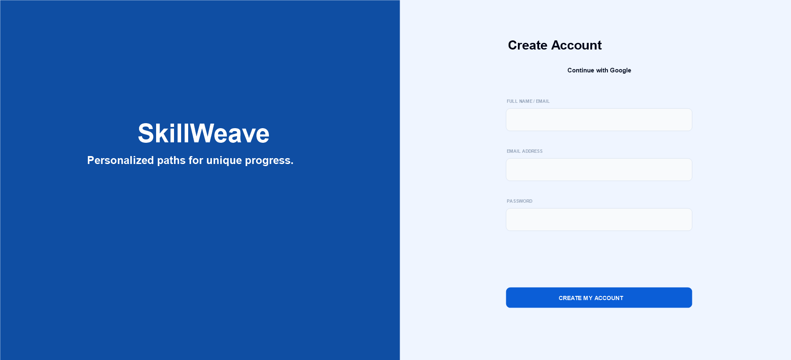
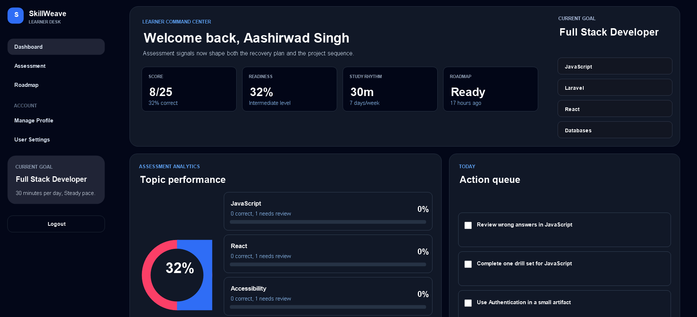
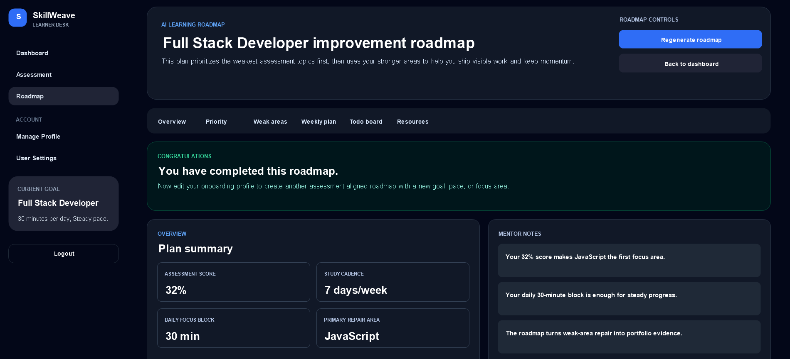
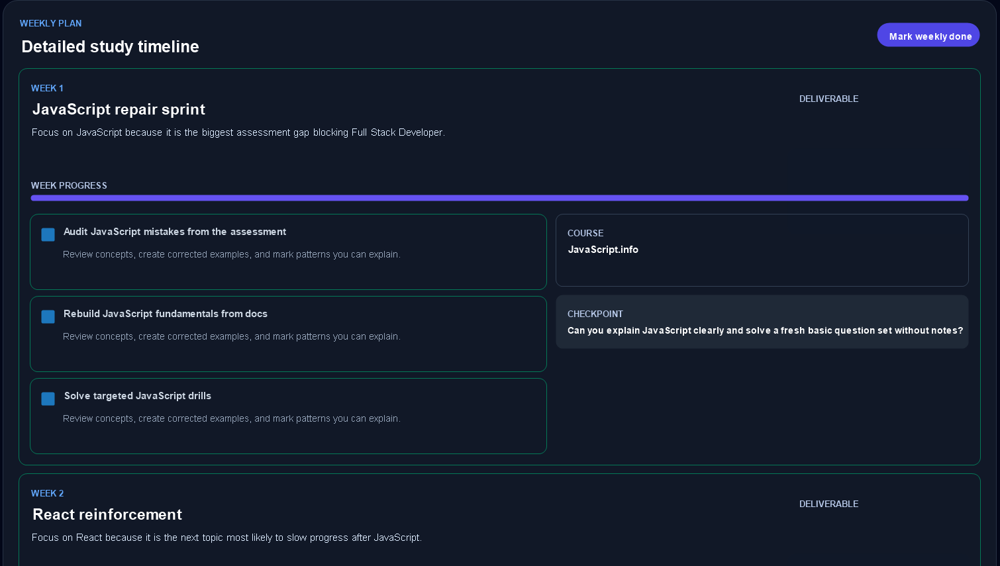
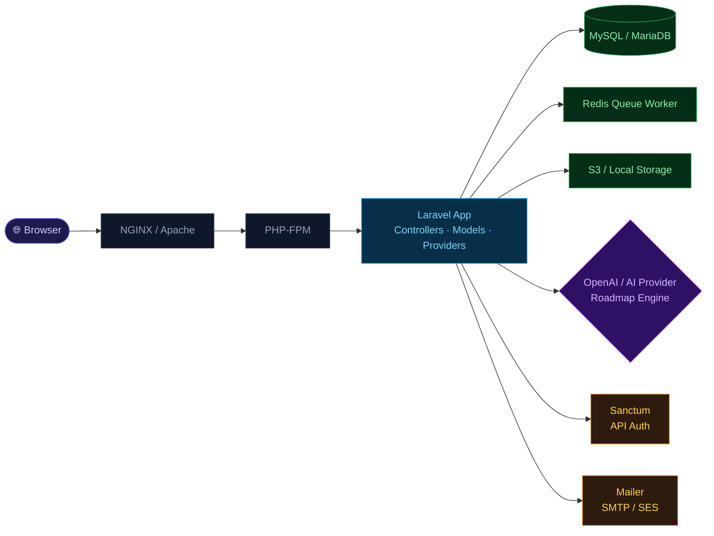
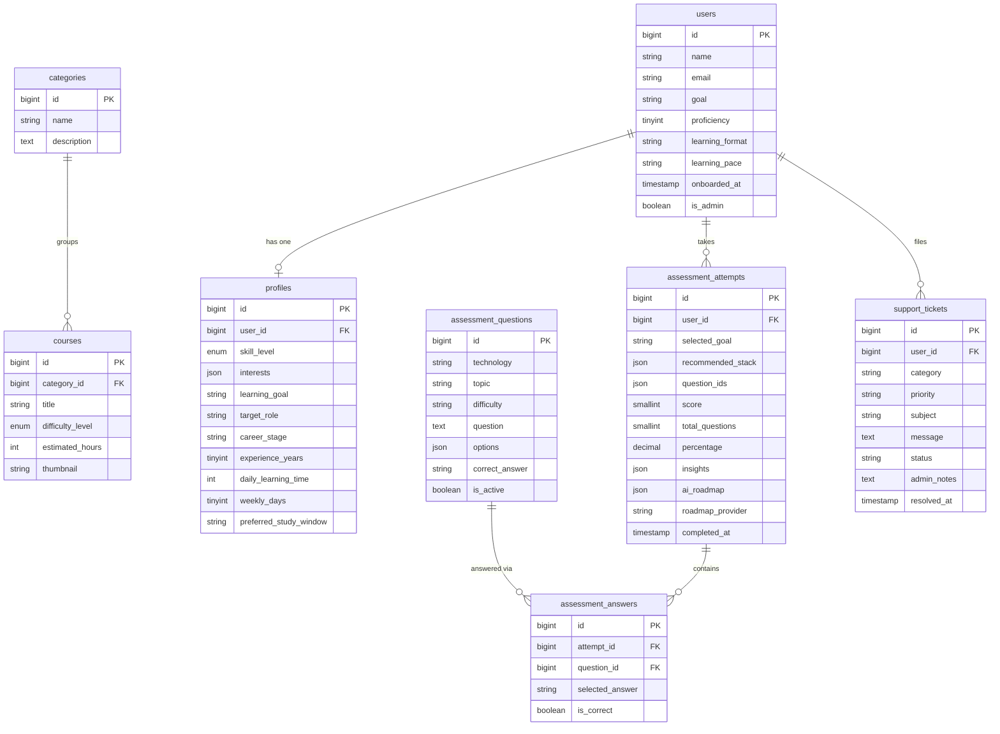

<div align="center">

<br/>


# Dynamic — Learning Planner & Roadmap Generator

**Assess your skills. Get a personalised AI roadmap. Track your progress.**

Dynamic is a full-featured Laravel application that takes learners through a short technical assessment, recommends personalised technology stacks, and generates AI-powered, week-by-week study roadmaps — all tailored to their goals, pace, and schedule.

<br/>

[](https://php.net)
[](https://laravel.com)
[](https://mysql.com)
[](https://laravel.com/docs/sanctum)
[](https://vitejs.dev)
[](LICENSE)

<br/>

</div>

---

## 📸 Screenshots

<br/>

**Landing Page**



<br/>



<br/>

---

**Authentication**

<table>
<tr>
<td width="50%">



</td>
<td width="50%">



</td>
</tr>
<tr>
<td align="center"><sub>Sign In</sub></td>
<td align="center"><sub>Create Account</sub></td>
</tr>
</table>

<br/>

---

**Learner Dashboard**



<br/>

---

**AI Roadmap**



<br/>

---

**Weekly Plan**



<br/>

---

## 📋 Table of Contents

- [Overview](#-overview)
- [Key Features](#-key-features)
- [Tech Stack](#-tech-stack)
- [Architecture](#-architecture)
- [Database Schema](#-database-schema)
- [API & Routes](#-api--routes)
- [Models](#-models)
- [Installation](#-installation)
- [Seeding & Tests](#-seeding--tests)
- [Deployment](#-deployment)
- [Contributing](#-contributing)
- [License](#-license)

---

## 🎯 Overview

Dynamic (branded as **SkillWeave**) solves the static learning problem. Most learning platforms give everyone the same path — Dynamic adapts. It starts with a 25-question assessment to identify your strongest and weakest areas, then an AI provider generates a phased, week-by-week roadmap that prioritises your gaps first and builds momentum through your strengths.

Learners get:

- A scored, insight-rich assessment result
- A recommended technology stack for their chosen goal
- A day-by-day, week-by-week learning plan with deliverables and checkpoints
- A resource library, todo board, and project suggestions
- A dashboard with live topic performance analytics and an action queue

Admins get full user management and a support ticket console.

---

## ✨ Key Features

| Feature | Description |
|---|---|
| 🎯 **Assessment Engine** | 25 adaptive questions across technologies; tracks attempts, answers, score, percentage, and insights |
| 🤖 **AI Roadmap Generation** | Pluggable AI provider (OpenAI / custom) generates a phased `ai_roadmap` JSON per attempt |
| 📊 **Learner Dashboard** | Live readiness score, topic performance chart, study rhythm, and prioritised action queue |
| 🗓️ **Weekly Plan** | Week-by-week breakdown with tasks, time estimates, priority levels, courses, and checkpoints |
| 👤 **Rich Profiles** | Bio, education, skill level, interests, career stage, target role, weekly days, study window |
| 📚 **Course Catalog** | Categorised courses with difficulty (Beginner → Advanced), estimated hours, and thumbnails |
| 🚀 **Onboarding Flow** | Collects goal, proficiency, learning format, and pace before the first assessment |
| 🎫 **Support Tickets** | Users file categorised tickets with priority; admins resolve with notes and timestamps |
| 🛡️ **Admin Console** | Full user management and ticket resolution panel behind the `is_admin` flag |
| 🔐 **Sanctum API Auth** | Token-based authentication for all JSON API endpoints |

---

## 🛠 Tech Stack

| Layer | Technology |
|---|---|
| **Runtime** | PHP 8.1+ |
| **Framework** | Laravel (latest stable) |
| **Database** | MySQL / MariaDB (SQLite supported for local dev) |
| **Auth** | Laravel Sanctum |
| **Templating** | Blade |
| **Assets** | Vite + npm |
| **Queue / Cache** | Redis (optional) |
| **AI Integration** | OpenAI API (or any provider via `roadmap_provider` field) |
| **Storage** | S3 / Local disk |

---

## 🏗 Architecture



**Directory layout:**

```
app/
├── Http/Controllers/     # Request handling — auth, onboarding, assessment, roadmap, admin, tickets
├── Models/               # Eloquent models and relations
├── Providers/            # Service providers
└── Support/              # Helper classes

routes/
├── web.php               # Blade-rendered views
└── api.php               # JSON endpoints (Sanctum-protected)

database/
├── migrations/           # All schema migrations
└── seeders/              # Sample data seeders
```

---

## 🗄 Database Schema



> Full migration definitions live in [`database/migrations/`](database/migrations).

---

## 🔌 API & Routes

### Public JSON API

| Method | Endpoint | Description |
|---|---|---|
| `GET` | `/api/categories` | List all categories |
| `GET` | `/api/courses` | List all courses |

### Authenticated API (Sanctum token required)

| Method | Endpoint | Description |
|---|---|---|
| `POST` | `/api/categories` | Create a category |
| `POST` | `/api/courses` | Create a course |
| `GET` | `/api/profile` | Get authenticated user's profile |
| `POST` | `/api/profile` | Store profile |
| `PUT` | `/api/profile` | Update profile |

### Web Routes (Blade)

| Route | Description |
|---|---|
| `GET /` | Landing page |
| `GET /login` · `POST /login` | Authentication |
| `GET /register` · `POST /register` | Registration |
| `GET /onboarding` | Onboarding form |
| `GET /assessment` | Start assessment |
| `POST /assessment/submit` | Submit answers |
| `GET /dashboard` | Learner dashboard |
| `GET /roadmap` | AI roadmap view |
| `GET /tickets` | Support tickets |
| `GET /settings` | Account settings |
| `GET /admin` | Admin dashboard |
| `GET /admin/users` | User management |
| `GET /admin/tickets` | Ticket management |

> See [`routes/web.php`](routes/web.php) and [`routes/api.php`](routes/api.php) for the complete definitions.

---

## 🧩 Models

| Model | Key Relations & Fields |
|---|---|
| `User` | `hasOne Profile`, `hasMany AssessmentAttempt`, `hasMany SupportTicket`; `is_admin` flag |
| `Profile` | `belongsTo User`; `skill_level` enum, `interests` JSON, `target_role`, `daily_learning_time` |
| `Category` | `hasMany Course` |
| `Course` | `belongsTo Category`; `difficulty_level` enum, `estimated_hours` |
| `AssessmentQuestion` | `hasMany AssessmentAnswer`; `options` JSON, `correct_answer`, `is_active` |
| `AssessmentAttempt` | `belongsTo User`, `hasMany AssessmentAnswer`; `ai_roadmap` JSON, `roadmap_provider`, `percentage` |
| `AssessmentAnswer` | `belongsTo AssessmentAttempt`, `belongsTo AssessmentQuestion`; `is_correct` |
| `SupportTicket` | `belongsTo User`; `priority`, `status`, `admin_notes`, `resolved_at` |

> Refer to [`app/Models/`](app/Models) for full relations and helper methods.

---

## 🚀 Installation

### Prerequisites

- PHP 8.1+
- Composer
- Node.js & npm
- MySQL / MariaDB _(or SQLite for quick local dev)_

### Steps

**1. Clone the repository**

```bash
git clone <your-repo-url> dynamic
cd dynamic
```

**2. Install PHP dependencies**

```bash
composer install
```

**3. Configure environment**

```bash
cp .env.example .env
php artisan key:generate
```

Then open `.env` and set your values:

```env
DB_CONNECTION=mysql
DB_HOST=127.0.0.1
DB_DATABASE=dynamic
DB_USERNAME=root
DB_PASSWORD=

# AI Provider
OPENAI_API_KEY=sk-...
OPENAI_MODEL=gpt-4o

# Mail
MAIL_MAILER=smtp
MAIL_HOST=...
```

**4. Install frontend assets** _(optional)_

```bash
npm install
npm run dev
```

**5. Run migrations and seeders**

```bash
php artisan migrate --seed
```

**6. Start the development server**

```bash
php artisan serve
```

Open [http://localhost:8000](http://localhost:8000) 🎉

---

### Quick start with SQLite

For rapid local testing, skip MySQL entirely:

```bash
# In .env
DB_CONNECTION=sqlite

# Create the file
touch database/database.sqlite

# Then migrate
php artisan migrate --seed
```

---

## 🌱 Seeding & Tests

**Seed sample data:**

```bash
php artisan db:seed
```

Seeders live in [`database/seeders/`](database/seeders).

**Run the test suite:**

```bash
php artisan test
```

Tests live in [`tests/`](tests). Run specific suites with:

```bash
php artisan test --filter AssessmentTest
```

---

## ☁️ Deployment

Standard Laravel production deployment:

```bash
# Install production deps only
composer install --no-dev --optimize-autoloader

# Cache config, routes, and views
php artisan config:cache
php artisan route:cache
php artisan view:cache

# Run migrations
php artisan migrate --force

# Start queue worker (supervisor recommended)
php artisan queue:work --daemon
```

**Recommended setups:**

| Option | Notes |
|---|---|
| **Laravel Forge** | Managed servers + zero-downtime deploys |
| **Laravel Vapor** | Serverless on AWS |
| **Docker** | Containerise for portability and consistency |

**Security checklist before going live:**

- [ ] `.env` is out of version control (`.gitignore`)
- [ ] AI provider keys are in a secrets manager
- [ ] `SANCTUM_STATEFUL_DOMAINS` and CORS are configured
- [ ] `APP_ENV=production` and `APP_DEBUG=false`
- [ ] SSL/TLS certificate in place
- [ ] Queue workers supervised (Supervisor / systemd)

---

## 🤝 Contributing

Contributions are welcome!

1. **Fork** the repository
2. **Create** a feature branch: `git checkout -b feature/my-feature`
3. **Commit** your changes: `git commit -m 'Add some feature'`
4. **Push** to the branch: `git push origin feature/my-feature`
5. **Open** a Pull Request with a clear description of what changed and why

Please run `php artisan test` locally and ensure no regressions before opening a PR.

---

## 🔒 Security

- Never commit `.env` or API keys to source control
- Use a secrets manager (AWS Secrets Manager, Vault, etc.) for production credentials
- Rotate AI provider keys regularly and audit access logs
- Report security vulnerabilities privately via email rather than opening a public issue

---

## 📄 License

This project is licensed under the [MIT License](LICENSE).

---

<div align="center">

Built with ❤️ using **Laravel** · **PHP** · **OpenAI**

<br/>

<sub>Dynamic — Personalized paths that evolve with your progress.</sub>

</div>
