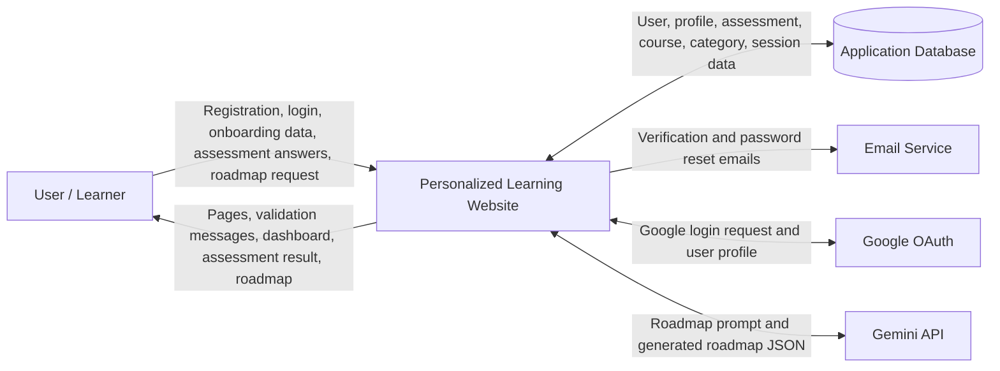
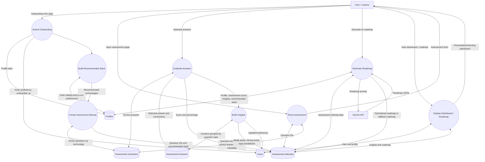

# Data Flow Diagram for Personalized Learning Website

This document describes the data flow of the Laravel-based personalized learning website. The website supports user registration, email verification, login, onboarding, assessment, dashboard analytics, AI roadmap generation, and course/category/profile APIs.

## Level 0 DFD: Context Diagram

## Level 1 DFD: Main Website Processes

```mermaid
flowchart TB
    U[User / Learner]

    P1((1. Authentication))
    P2((2. Onboarding))
    P3((3. Assessment))
    P4((4. Dashboard))
    P5((5. Roadmap Generation))
    P6((6. Course and Profile API))

    D1[(D1 Users)]
    D2[(D2 Profiles)]
    D3[(D3 Assessment Questions)]
    D4[(D4 Assessment Attempts)]
    D5[(D5 Assessment Answers)]
    D6[(D6 Courses)]
    D7[(D7 Categories)]
    D8[(D8 Sessions / Cache)]

    E1[Email Service]
    E2[Google OAuth]
    E3[Gemini API]

    U -->|Name, email, password, goal| P1
    U -->|Login credentials / Google login| P1
    P1 -->|Create or authenticate user| D1
    P1 <-->|Session state| D8
    P1 -->|Verification / reset email request| E1
    P1 <-->|Google account details| E2
    P1 -->|Auth status and redirects| U

    U -->|Education, skill level, interests, goal, schedule, preferences| P2
    P2 -->|Create / update profile| D2
    P2 -->|Update goal, proficiency, onboarding status| D1
    P2 -->|Create initial assessment attempt| D4
    P2 <-->|Select questions by recommended technologies| D3
    P2 -->|Redirect to assessment| U

    U -->|Assessment answers| P3
    P3 <-->|Load active questions| D3
    P3 <-->|Load current attempt| D4
    P3 -->|Save selected answers and correctness| D5
    P3 -->|Save score, percentage, weak areas, strong areas| D4
    P3 -->|Update proficiency| D1
    P3 -->|Redirect to dashboard| U

    U -->|Dashboard request| P4
    P4 <-->|User account and proficiency| D1
    P4 <-->|Learner profile| D2
    P4 <-->|Attempt, score, insights, AI roadmap| D4
    P4 <-->|Answers with question topics| D5
    P4 -->|Progress, topic breakdown, modules, roadmap widgets| U

    U -->|Generate roadmap request| P5
    P5 <-->|Profile, assessment, answers, insights| D2
    P5 <-->|Assessment result and weak areas| D4
    P5 -->|Prompt with learner profile and assessment summary| E3
    E3 -->|Generated roadmap JSON| P5
    P5 -->|Fallback roadmap if Gemini is unavailable| P5
    P5 -->|Save AI roadmap, provider, generated time| D4
    P5 -->|Roadmap page| U

    U -->|API requests: categories, courses, profile| P6
    P6 <-->|Read / create categories| D7
    P6 <-->|Read / create courses| D6
    P6 <-->|Read / create / update profile| D2
    P6 -->|JSON responses| U
```

## Level 2 DFD: Assessment and Roadmap Flow

## Data Stores

| ID | Data Store | Main Data Stored |
| --- | --- | --- |
| D1 | Users | Name, email, hashed password, goal, proficiency, email verification status, onboarding status |
| D2 | Profiles | Education level, career stage, skill level, interests, learning goal, target role, study schedule, preferences |
| D3 | Assessment Questions | Technology, topic, question text, options, correct answer, explanation, active status |
| D4 | Assessment Attempts | Selected goal, recommended stack, selected question IDs, score, percentage, insights, AI roadmap |
| D5 | Assessment Answers | User-selected answers, correctness, linked attempt, linked question |
| D6 | Courses | Course title, description, difficulty level, estimated hours, thumbnail, category |
| D7 | Categories | Category name, description, course count |
| D8 | Sessions / Cache | Login session, CSRF/session state, temporary application cache |

## External Entities

| Entity | Purpose |
| --- | --- |
| User / Learner | Uses the website, submits account details, onboarding data, assessment answers, and roadmap requests |
| Email Service | Sends email verification and password reset emails |
| Google OAuth | Provides third-party login and Google account profile details |
| Gemini API | Generates a personalized roadmap from the learner profile and assessment insights |

## Short Report Explanation

The system begins when a learner registers or logs in. Registration data is validated, the password is hashed, and the user record is stored in the database. The system sends an email verification link before allowing the learner to continue. A learner can also log in through Google OAuth, where Google returns basic account details used to create or authenticate the local user.

After authentication, the learner completes onboarding. The onboarding process stores profile information such as education level, skill level, interests, learning goal, target role, preferred learning format, study time, and pace. The system uses this information to calculate a recommended learning stack and create an assessment attempt with selected questions from the assessment question bank.

During the assessment, the learner submits answers for the assigned questions. The system compares the submitted answers with stored correct answers, saves each response, calculates the score and percentage, and builds insights such as weak areas, strong areas, and topic-wise performance. These results are saved in the assessment attempt and used to update the learner's proficiency.

The dashboard reads user, profile, assessment, answer, and roadmap data to show personalized progress, weak-topic analysis, recommended modules, and learning guidance. When the learner requests a roadmap, the system sends profile and assessment insights to the Gemini API. If Gemini returns a valid roadmap, the website saves it; otherwise, the system creates a fallback roadmap locally. The final roadmap is displayed to the learner and reused on the dashboard.
